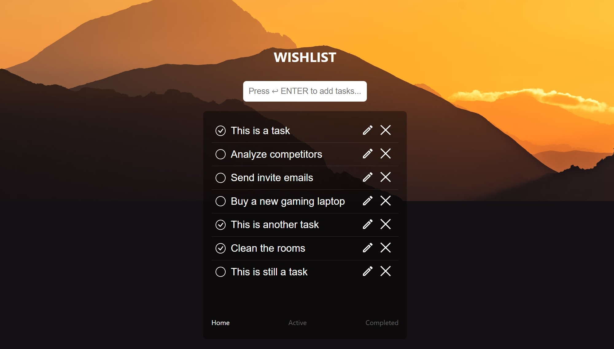

`#react.js` `#master-in-software-engineering`

<!-- ALL-CONTRIBUTORS-BADGE:START - Do not remove or modify this section -->

[](#contributors-)

<!-- ALL-CONTRIBUTORS-BADGE:END -->

# Assembler School: React.js Wish/Todo List <!-- omit in toc -->

In this project you will will be able to interact and usa a React.js Wish/Todo list.

## Table of Contents <!-- omit in toc -->

- [Getting Started](#getting-started)
- [The Project](#the-project)
- [Installation Process](#installation-process)
- [Project delivery](#project-delivery)
- [Resources](#resources)

## Getting Started

This is a wishlist feature for an e-commerce app built with React that allows users to save there list they are interested in purchasing for future reference. The wishlist feature is built using `useState`, `useEffect`, `useContext`, `input events`and other hooks in order to create a seamless user experience.

## The Project

This is a wishlist feature for an e-commerce app built with React that allows users to save there list they are interested in purchasing for future reference. The wishlist feature is built using useState, useEffect, useContext and input events to create a seamless user experience.



## Installation Process

First, you will need to clone the repo:

```bash
$ git clone https://github.com/joejoyjoy/react_e-commerce.git
```

Then, you will have to change brance:

```bash
$ git checkout wish-list
```

After so, you will have to install all the dependencies with npm:

```bash
$ npm install
```

Finally, you will have to start the npm server:

```bash
$ npm start
```

## Conclusion

The wishlist feature is an important component of any e-commerce app that allows users to save products for future purchase. By using useState, useEffect, useContext and input events, we can create a wishlist that provides a seamless user experience. The must-have features ensure that the basic functionality of the wishlist is in place, while the should-have features provide additional functionality that can enhance the user's experience.

## License <!-- omit in toc -->

This project is licensed under the MIT License - see the [LICENSE](LICENSE) file
for details

## Contributors ✨ <!-- omit in toc -->

This project follows the
[all-contributors](https://github.com/all-contributors/all-contributors)
specification. Contributions of any kind welcome!