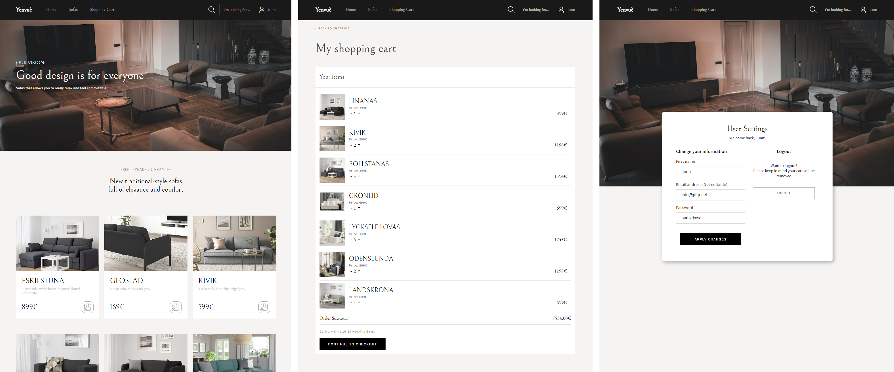
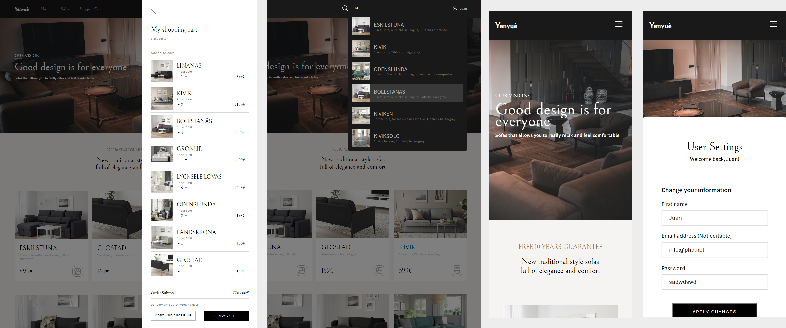

`#react.js` `#master-in-software-engineering` `#assembler-institute-of-technology`

<!-- ALL-CONTRIBUTORS-BADGE:START - Do not remove or modify this section -->

[](#contributors-)

<!-- ALL-CONTRIBUTORS-BADGE:END -->

# React E-commerce <!-- omit in toc -->

This is a demo app that help me learn the basics of React and to create a e-commerce using hooks.

## Table of Contents <!-- omit in toc -->

- [The repo](#the-repo)
- [Getting Started](#getting-started)
- [The Project](#the-project)

### The repo

First, you will need to clone the repo:

```bash
$ git clone https://github.com/joejoyjoy/react_e-commerce.git
```

## Getting Started

Run `npm i` in the terminal to install the dependencies.

Then, run `npm start` to start up the app.

The app will be run by default in the following url: `http://localhost:3000/`

Then, run `npm run api` to start the local json server.

The server will be run by default in the following url: `http://localhost:3500/sofas`

## The Project

In this e-commerce project you will have a full responsive experience with a [home page](./src/pages/Home/Home.jsx), [sign up](./src/pages/Login/Login.jsx), [shopping cart](./src/pages/Cart/Cart.jsx), and a [sidebar cart](./src/pages/Home/ShoppingCart/Sidebar/Sidebar.jsx) when a product is added. There is also present a searchbar.




## License <!-- omit in toc -->

This project is licensed under the MIT License - see the [LICENSE](LICENSE) file
for details

## Contributors ✨ <!-- omit in toc -->

This project follows the
[all-contributors](https://github.com/all-contributors/all-contributors)
specification. Contributions of any kind welcome!
